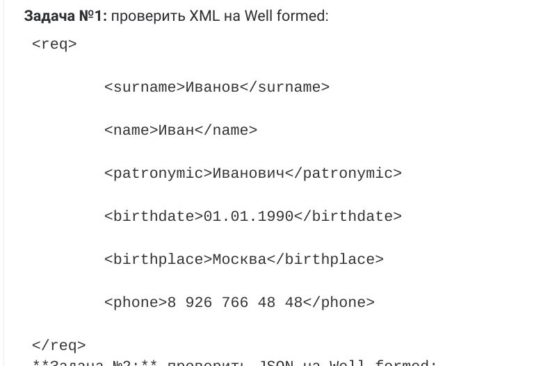
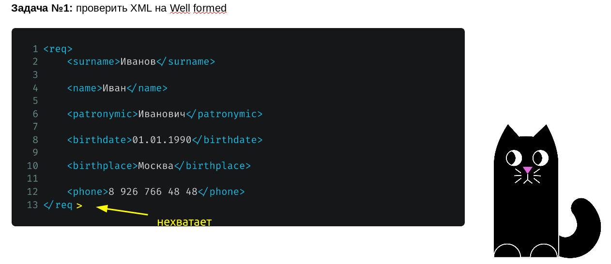
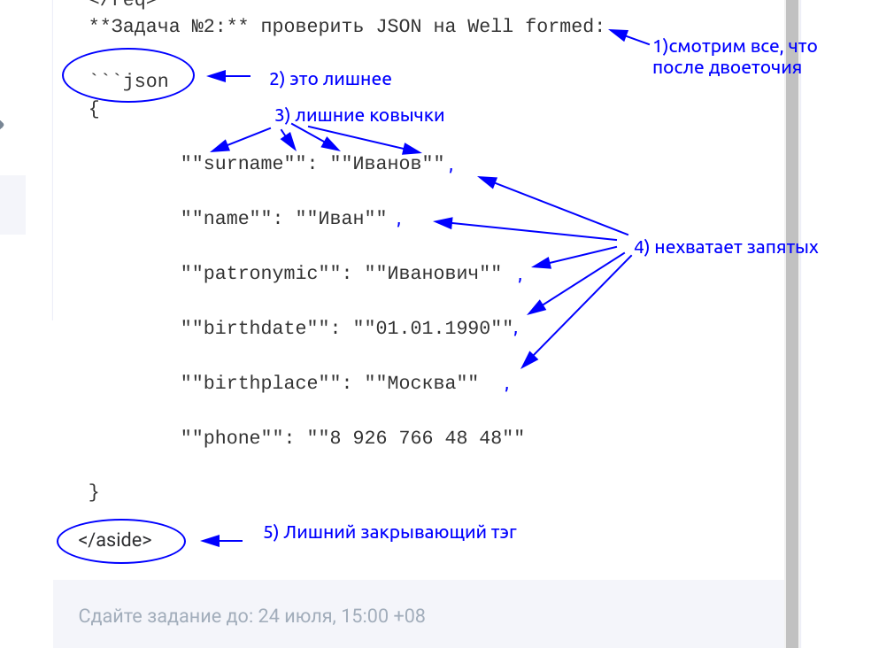
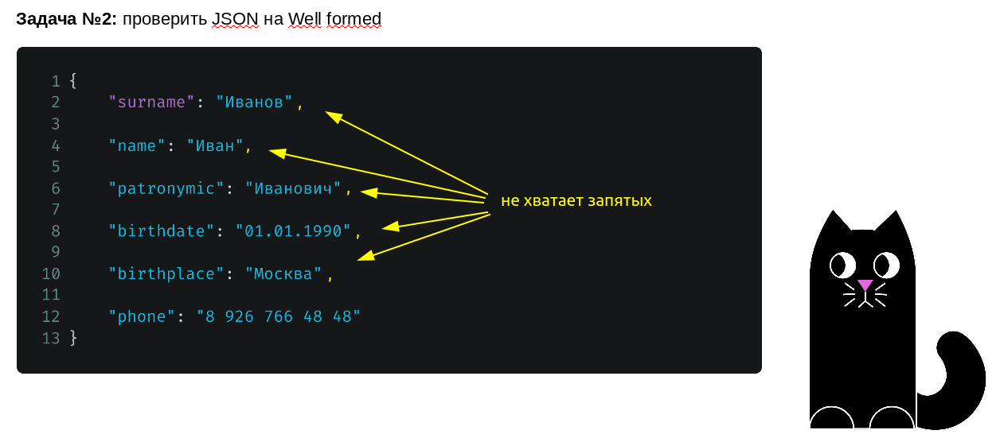

# Домашнее задание №5

-" В связи с тем, что задание на сайте gb.ru и в презентации немного различаются, ответ будет двойным на каждую задачу"

## Задача 1

Всё нормально: 

А здесь не хватает закрывающей угловой скобки у закрывающего тэга "reg": 

## Задача 2

Слишком много ковычек, есть лишние элементы и не хватает запятых: 

А тут просто нет запятых: 
