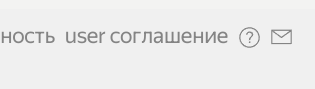
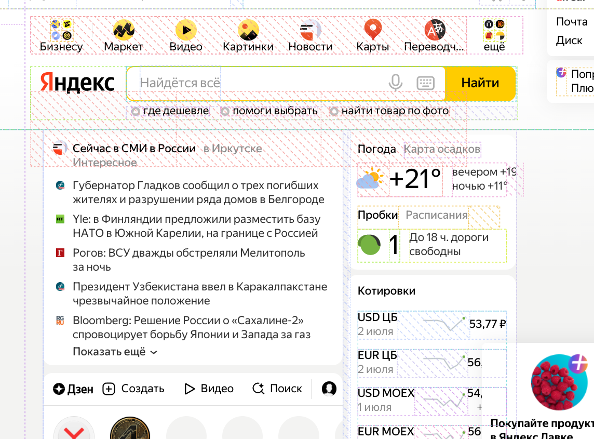
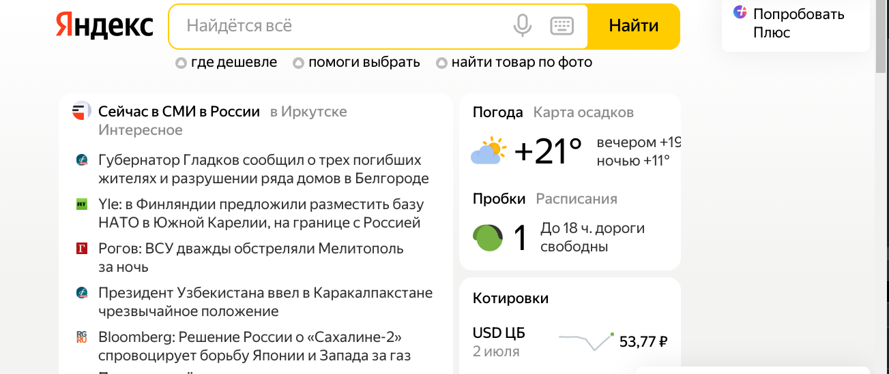
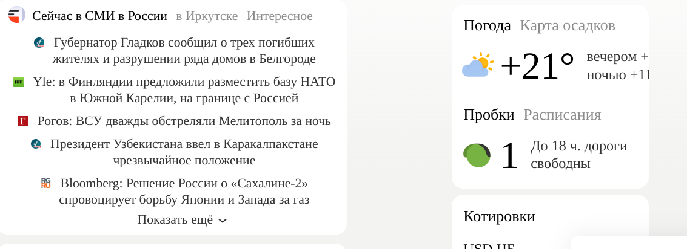

# Home Work 1

## задание

Задача: на основе сайта yandex.ru:

* Определите, на каком протоколе работает сайт. (yandex.ru)

* Проанализируйте структуру страницы сайта. (yandex.ru)

* Внесите не менее 10 изменений на страницу с помощью инструмента разработчика и представьте скриншоты было/стало. (yandex.ru)

* Создайте прототип низкой детализации (дополнительное задание, если на семинаре дошли до задания №8, за основу можно выбрать любой сайт). Webstorm IDE

---

* Определите, на каком протоколе работает сайт. (yandex.ru)

Сайт рботает по протоколу https: 

---

* Проанализируйте структуру страницы сайта. (yandex.ru)

* Внесите не менее 10 изменений на страницу с помощью инструмента разработчика и представьте скриншоты было/стало. (yandex.ru)

 - 

 - 

 - 

 - 

---

## Честно говоря мне надоело дальше играться с изменениями дизайна

---
